# GarbGarb

## Full-stack e-commerce shop

#### [URL](https://garbgarb.vercel.app/)

A full-stack e-commerce store selling unique t-shirts, sweatshirts and hoodies with some... unique slogans printed on the front that I've seen on the internet.

It's currently using Stripe in Test mode and the order's status is Draft so no actual orders are being made, but it would work by changing Stripe to Live mode and by appending `?confirm=1` to the order request URL.

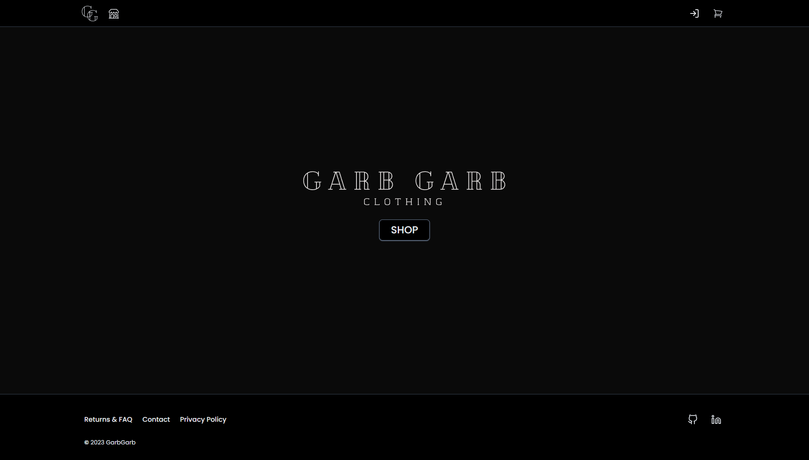

Products can be filtered by size with toggle buttons and by name and color by typing in the input element. Hovering over a colored box in the product card will show the color's name used by the fulfillment company and clicking it will take the user to the product page with that color already selected.

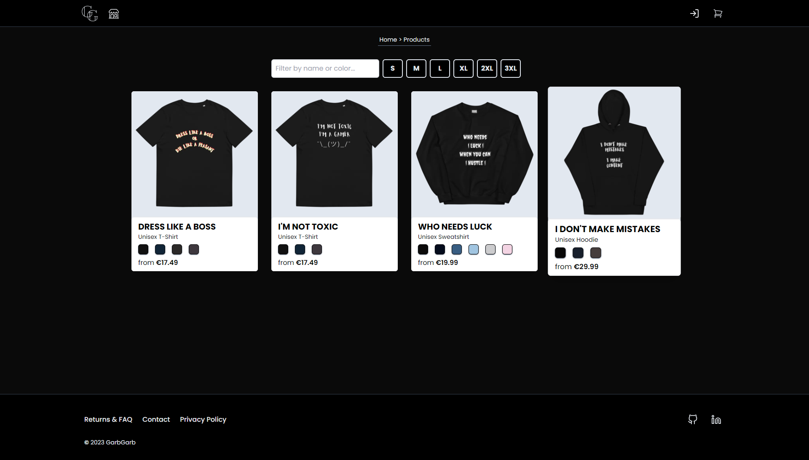

Before the product page is loaded, there's a stock check for each of the color + size pairs. The page itself allows the user to change the color, select the in-stock size for that color and add up to 99 of the product variant to the cart. The user can also check the size guide to order the right size for themselves.

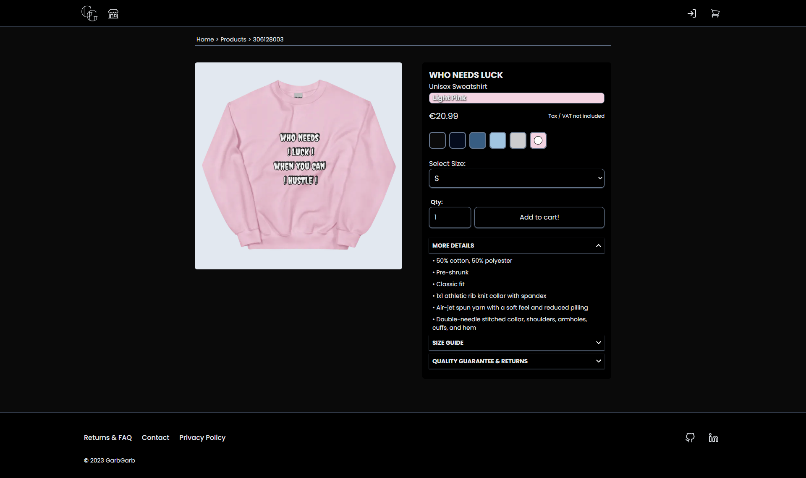

Cart page is just a simple display of products and their subtotal price. User can remove the product or change the quantity.

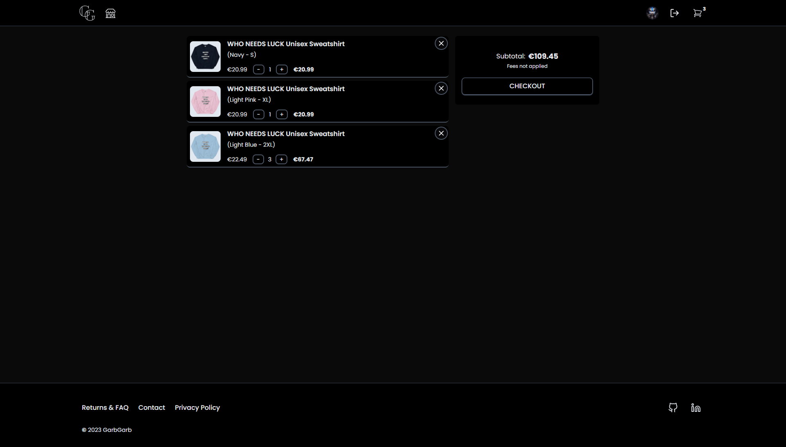

Checkout consists of 4 steps: Account, Cart, Shipping and Review

Account: User chooses if they want to buy as a guest user or if they want to sign in with an account. If the user is already signed in, this stepped is skipped.

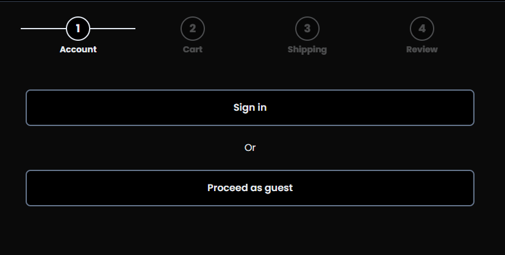

Cart: User sees cart overview for their order. If the product becomes marked as out of stock while completing the order, a button to remove the product will appear, product card will get a red shadow and the name will be struck-through. The button to go to the next step will be disabled as long as there's a product marked as out of stock in the cart.

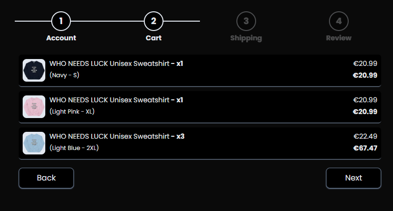
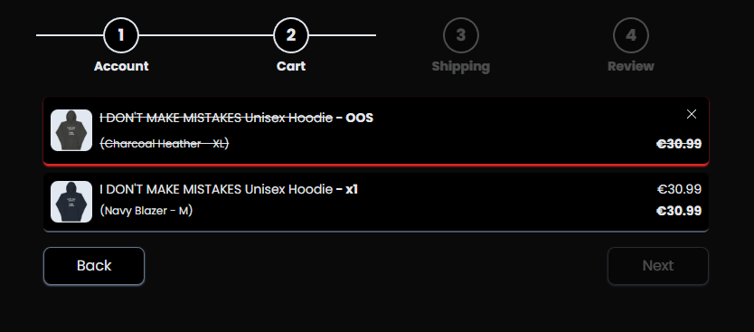

Shipping: User must enter their full name, email and shipping address. If there's an error for an input value, it will get a red border and the error message below it.
When the user starts typing their street name, UI shows some google suggested addresses the user can click to autofill the remaining information. Click outside of the form to make the suggestions disappear.

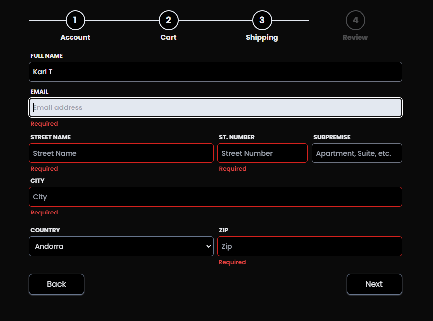
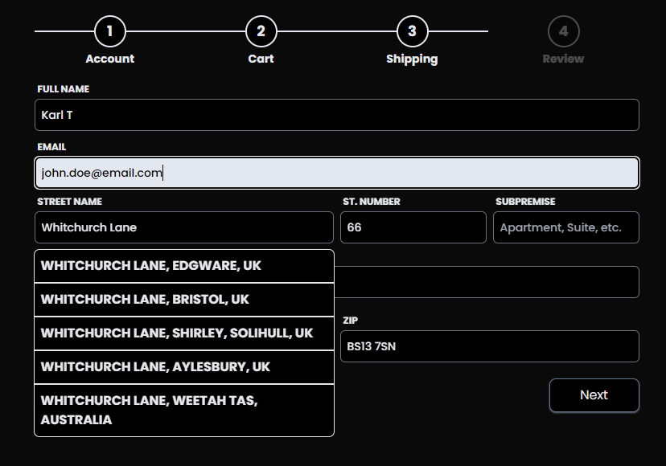

Review: User sees all of their shipping information, all products in their cart as well as estimated shipping price, VAT percentage and the estimated total price. The button to go to payment will be disabled until the shipping and VAT is calculated and if there's any other errors that come up.
"Go to Payment" button takes the user to a Stripe checkout session where they enter their phone number and payment information.

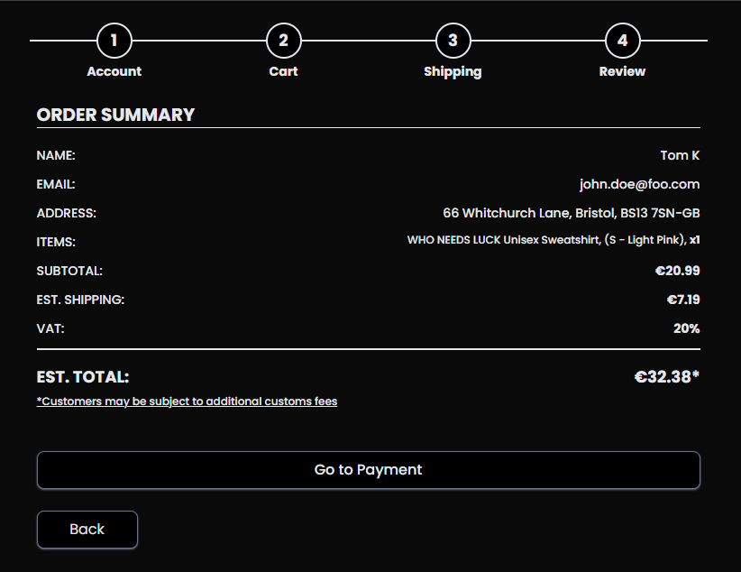

After the checkout is successful, user is greeted with a Success page and the order is made.

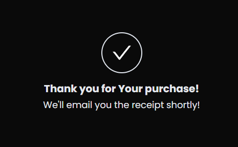

If the user made completed the order while signed in, they can visit their profile page to see all of the orders they made using that account. User can delete only canceled orders. If the user wishes to delete their account, all of their order data will be deleted as well. A confirmation modal pops up to confirm account deletion.

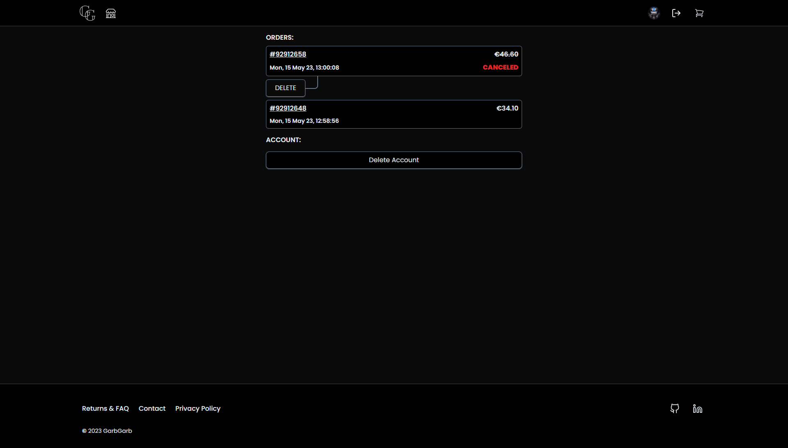

Clicking on an order will take the user to the order page where they can see all details about their order. User can also request an invoice to be resent to their email and cancel the order.

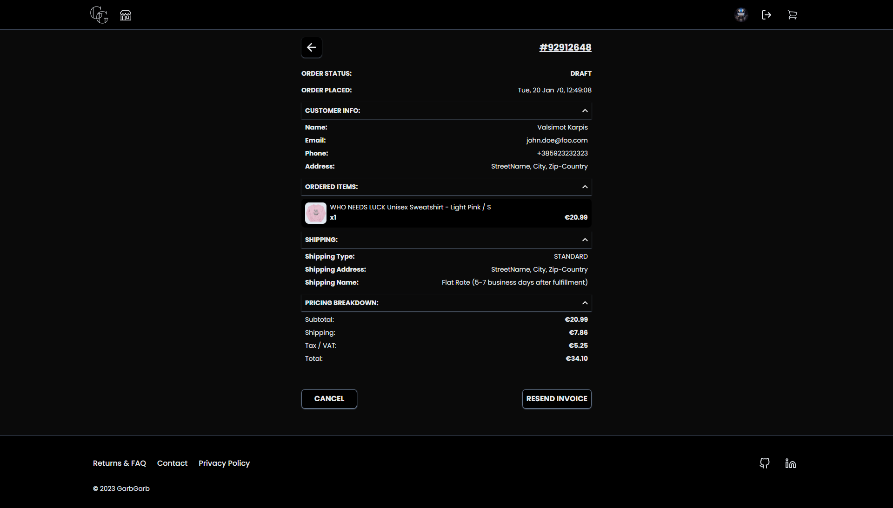

Once the order is canceled, information about it will become greyed out.

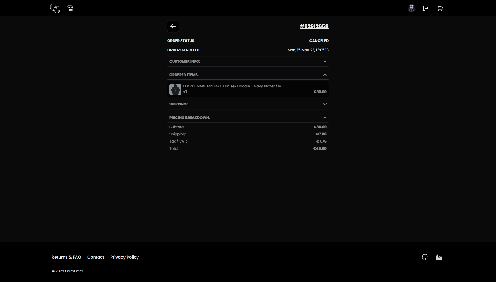

### Technologies and libraries used:

Next.js, Typescript, TailwindCSS, Prisma, NextAuth, Redux Toolkit, Tanstack Query, Tanstack Table, Axios, Zod, React-hook-form, Stripe, Google Places Autocomplete

## How to install

Download and install Node and NPM from https://nodejs.org/en/download.

Once downloaded, run thes commands in the terminal:

```ts
$ git clone https://github.com/mrperrytpx/garbgarb
$ cd .\garbgarb\
$ npm install
```

Then set the correct environment variables in .env.

`npm run dev` to run it in dev mode.
`npm run build` to make a production build, run the production build with `npm run start`

## Introspection

#### `What was your motivation?`

My motivation was further improvement as a self-taught software developer and to become hireable for a front-end position.

#### `Why did you build this project?`

I built this project to mainly teach myself Next.js, Typescript and TailwindCSS because those seem like valuable skills to have in web development. I also wanted to challenge myself to step out of my comfort zone as well as build a good project for my portfolio.

#### `What did you learn?`

I learned how to work with Next.js and Typescript, how to even more effectively work with multiple APIs at the same time, how TailwindCSS works and how to extend the baseline classes with custom ones, how to customize NextAuth default pages and how to deploy a MySQL database to Planetscale using Prisma.

I learned how to properly report API documentation bugs since I had to do it 4 times and how interation is key when it comes to designing pretty much anything, in my opinion.
